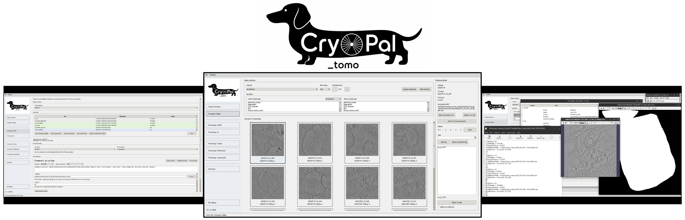
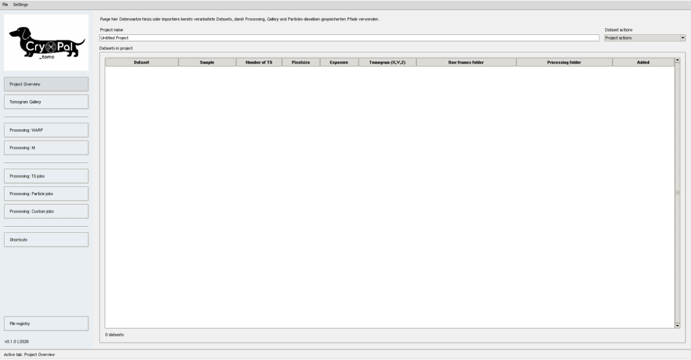

# CryoPal_tomo

[](https://doi.org/10.5281/zenodo.20812076)

CryoPal_tomo is a project-centered desktop application for organizing, launching, tracking, and documenting cryo-electron tomography processing workflows. It is designed to help users move from raw datasets to curated tomograms and downstream analysis while keeping paths, parameters, job histories, and reusable settings in one place.

CryoPal_tomo does not replace the underlying processing software. Instead, it acts as a practical coordination layer around tools such as Warp/WarpTools, MTools/MCore, PyTom, CryoLithe, slabify, MemBrain-seg, and custom lab-specific scripts.



## Installation

CryoPal_tomo does not require additional Python dependencies to get started. It runs directly with `python3`.

### Launch directly

```bash
python3 CryoPal_tomo.py
```

### Optional: launch as `CryoPal_tomo`

If you want to start it more conveniently from anywhere, add the repository directory to your `PATH`. For example, in `~/.bashrc`:

```bash
export PATH="/absolute/path/to/CryoPal_tomo:$PATH"
```

After reloading your shell:

```bash
source ~/.bashrc
```

you can launch it as:

```bash
CryoPal_tomo
```

This works because the repository already includes the executable launcher script [CryoPal_tomo](./CryoPal_tomo).

### Notes

- `python3` is sufficient for launching CryoPal_tomo itself.
- External processing tools such as WarpTools, MTools, PyTom, CryoLithe, slabify, or MemBrain-seg are managed separately and can be connected through environments or Slurm profiles inside CryoPal_tomo.
- If you plan to run jobs locally through the GUI, it is often useful to define one or more environments under `Settings > Manage environments`.

## Quick Start Guide

The shortest useful route into CryoPal_tomo is:

1. Launch CryoPal_tomo and create a new project through `File > New Project`.
2. Open `Project Overview` and add your first dataset through `Dataset actions > Add dataset for processing`.
3. Fill in the raw frames folder, MDOC folder, processing folder, and the core imaging parameters.
4. Move to `Processing: WARP`, select the dataset, choose the first WarpTools job you want to run, and inspect the command preview before execution.
5. After reconstruction jobs have produced thumbnails and tomograms, open `Tomogram Gallery` to review, rate, and tag tilt series.
6. Use `Multi selection` in the gallery to collect good tilt series and forward them into the `TS processing list` for downstream TS-based jobs.
7. Use `Settings > Check paths` and the CSV export functions under `File` whenever you want to validate or document project state.



Helpful mindset:

- Think of `Project Overview` as the place where CryoPal_tomo learns your dataset structure.
- Think of `Tomogram Gallery` as the place where you decide which tomograms are worth continued work.
- Think of the `TS processing list` as the handoff from curation to downstream TS jobs.

## Details

For the full user-facing documentation, workflows, screenshots, and conceptual explanation, please see the complete user guide:

- [CryoPal_tomo_user_guide_v0p1p0.pdf](docs/CryoPal_tomo_user_guide_v0p1p0.pdf)
- [CryoPal_documentation.md](docs/CryoPal_documentation.md)

The PDF is the primary user guide. The Markdown documentation is kept as a lighter-weight secondary reference inside the repository.

## A Friendly Note

CryoPal_tomo is under active development and is intended to support a range of cryo-ET workflows. As such, users may occasionally encounter bugs, missing edge-case handling, or workflow-specific limitations.

If you notice unexpected behavior, please report it. Clear bug reports are extremely valuable and help improve CryoPal_tomo for both current and future users.

Helpful bug reports usually include:

- what you were trying to do
- which tab or job type was involved
- what you expected to happen
- what happened instead
- relevant paths, settings, or screenshots if appropriate

## How to Cite CryoPal_tomo

If CryoPal_tomo contributes to your data processing, curation, or analysis workflow, please consider citing it in your thesis, manuscript, preprint, presentation, or software section.

Current Zenodo DOI status:

> Zenodo DOI: `10.5281/zenodo.20812076`

Recommended citation structure for now:

```text
Ehses, K. (2026). CryoPal_tomo: A project-centered software for organizing and processing cryo-electron tomography workflows. Zenodo. https://doi.org/10.5281/zenodo.20812076
```

It is a good idea to include:

- software name: `CryoPal_tomo`
- version, if appropriate
- author or maintainer information
- Zenodo DOI
- access date, if your journal or thesis style requests it

## References

CryoPal_tomo is designed to work alongside a range of established cryo-ET tools and related software ecosystems. Depending on your workflow, you may also want to cite the corresponding underlying methods and software directly.

- WARP / WarpTools
  https://warpem.github.io/
  > Tegunov, D., Cramer, P. Real-time cryo-electron microscopy data preprocessing with Warp. Nat Methods 16, 1146–1152 (2019). https://doi.org/10.1038/s41592-019-0580-y 
- M / MTools / MCore
  https://warpem.github.io/
  > Tegunov, D., Xue, L., Dienemann, C. et al. Multi-particle cryo-EM refinement with M visualizes ribosome-antibiotic complex at 3.5 Å in cells. Nat Methods 18, 186–193 (2021). https://doi.org/10.1038/s41592-020-01054-7 
- CryoLithe
  https://github.com/swing-research/CryoLithe
  > Kishore, V. et al. (2025). CryoLithe: Rapid Cryo-ET Reconstruction via Transform-Localized Deep Learning. arXiv.  	
https://doi.org/10.48550/arXiv.2501.15246 
- PyTom
  https://github.com/SBC-Utrecht/pytom-match-pick
  > Chaillet, M. L., Roet, S., & Förster, F. (2026). pytom-match-pick (0.13.2). Zenodo. https://doi.org/10.5281/zenodo.20556513`
- slabify
  https://github.com/CellArchLab/slabify-et
  >Righetto R., & Lamm L. (2024). CellArchLab/slabify-et: v0.3.0 (v0.3.0). Zenodo. https://doi.org/10.5281/zenodo.13964436`
- MemBrain-seg
  https://github.com/teamtomo/membrain-seg
  > Lamm, L. et al. MemBrain v2: an end-to-end tool for the analysis of membranes in cryo-electron tomography. (2025). bioRxiv. https://doi.org/10.1101/2024.01.05.574336 
